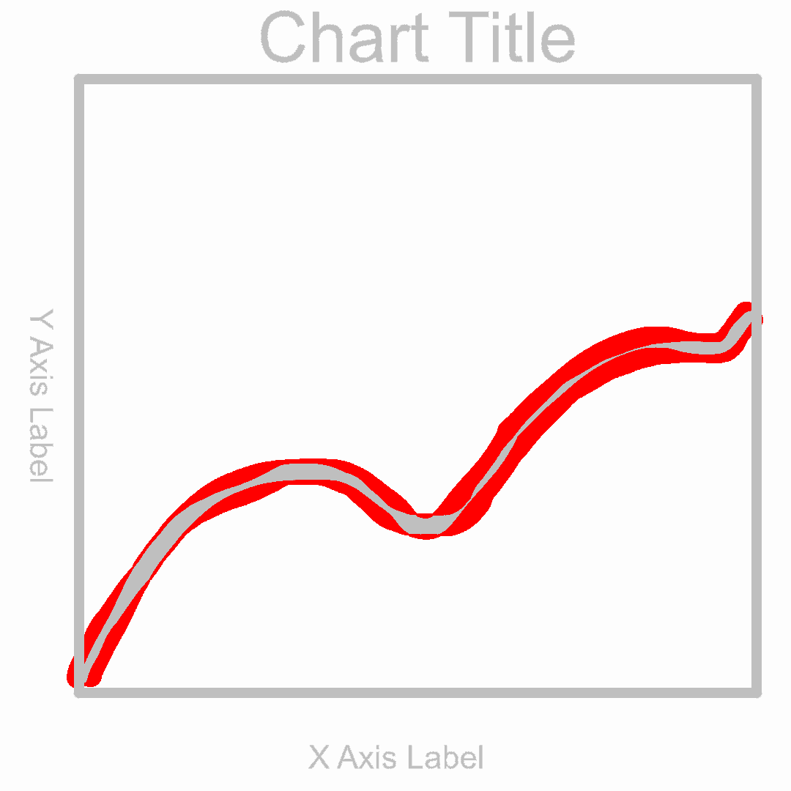

# Py-Image-Diff

A simple python image difference library. It returns the % difference of the
image. Additionally, it also saves the visual differences to a file called
`diff.png`.

Here is a sample image of the visual difference:



### Usage

To use the library you need to build the `.so`. Here is the go building command:
`go build -o lib.so -buildmode=c-shared library.go`

Usage of the library is really simple. The only exported function is `compare`.

```python
import imagediff

with open("a.png", 'rb') as a:
    with open("b.png", 'rb') as b:
        difference = library.compare(a.read(), b.read())
        print(difference)
```
